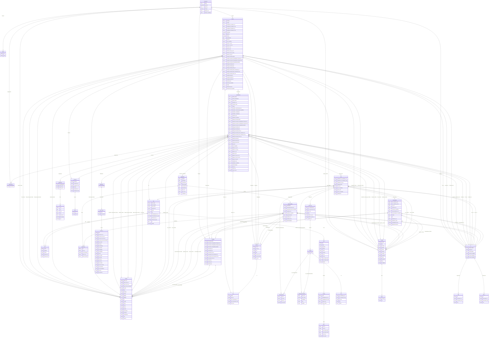

```mermaid
erDiagram
    Document ||--o| PstlAdr : "InitgPty_PstlAdr"
    Document ||--o| Id : "InitgPty_Id"
    Document ||--o| CtctDtls : "InitgPty_CtctDtls"
    Document ||--o| FwdgAgt : "FwdgAgt"
    Document ||--o{ Authstn : "Authstn*"
    Document ||--|{ PmtInf : "PmtInf*"
    Document ||--o{ SplmtryData : "SplmtryData*"
    Document {
        string MsgId
        dateTime CreDtTm
        string NbOfTxs
        decimal CtrlSum
        string InitgPty_Nm
        string InitgPty_CtryOfRes
    }
    PmtInf ||--o| PmtTpInf : "PmtTpInf"
    PmtInf ||--o| CdtrAcct : "CdtrAgtAcct"
    PmtInf ||--o| CdtrAcct : "ChrgsAcct"
    PmtInf ||--o| FwdgAgt : "ChrgsAcctAgt"
    PmtInf ||--o| PstlAdr : "Cdtr_PstlAdr"
    PmtInf ||--o| Id : "Cdtr_Id"
    PmtInf ||--o| CtctDtls : "Cdtr_CtctDtls"
    PmtInf ||--o| Id_1 : "CdtrAcct_Id"
    PmtInf ||--o| PstlAdr : "CdtrAgt_FinInstnId_PstlAdr"
    PmtInf ||--o| PstlAdr : "CdtrAgt_BrnchId_PstlAdr"
    PmtInf ||--o| PstlAdr : "UltmtCdtr_PstlAdr"
    PmtInf ||--o| Id : "UltmtCdtr_Id"
    PmtInf ||--o| CtctDtls : "UltmtCdtr_CtctDtls"
    PmtInf ||--o| PstlAdr : "CdtrSchmeId_PstlAdr"
    PmtInf ||--o| Id : "CdtrSchmeId_Id"
    PmtInf ||--o| CtctDtls : "CdtrSchmeId_CtctDtls"
    PmtInf ||--|{ DrctDbtTxInf : "DrctDbtTxInf*"
    PmtInf {
        string PmtInfId
        string PmtMtd
        string ReqdAdvcTp_CdtAdvc_Cd
        string ReqdAdvcTp_CdtAdvc_Prtry
        string ReqdAdvcTp_DbtAdvc_Cd
        string ReqdAdvcTp_DbtAdvc_Prtry
        boolean BtchBookg
        string NbOfTxs
        decimal CtrlSum
        date ReqdColltnDt
        string Cdtr_Nm
        string Cdtr_CtryOfRes
        string CdtrAcct_Tp_Cd
        string CdtrAcct_Tp_Prtry
        string CdtrAcct_Ccy
        string CdtrAcct_Nm
        string CdtrAcct_Prxy_Tp_Cd
        string CdtrAcct_Prxy_Tp_Prtry
        string CdtrAcct_Prxy_Id
        string CdtrAgt_FinInstnId_BICFI
        string CdtrAgt_FinInstnId_ClrSysMmbId_ClrSysId_Cd
        string CdtrAgt_FinInstnId_ClrSysMmbId_ClrSysId_Prtry
        string CdtrAgt_FinInstnId_ClrSysMmbId_MmbId
        string CdtrAgt_FinInstnId_LEI
        string CdtrAgt_FinInstnId_Nm
        string CdtrAgt_FinInstnId_Othr_Id
        string CdtrAgt_FinInstnId_Othr_SchmeNm_Cd
        string CdtrAgt_FinInstnId_Othr_SchmeNm_Prtry
        string CdtrAgt_FinInstnId_Othr_Issr
        string CdtrAgt_BrnchId_Id
        string CdtrAgt_BrnchId_LEI
        string CdtrAgt_BrnchId_Nm
        string UltmtCdtr_Nm
        string UltmtCdtr_CtryOfRes
        string ChrgBr
        string CdtrSchmeId_Nm
        string CdtrSchmeId_CtryOfRes
    }
    DrctDbtTxInf ||--o| PmtTpInf : "PmtTpInf"
    DrctDbtTxInf ||--o| CdtrAcct : "DbtrAgtAcct"
    DrctDbtTxInf ||--o| Tax : "Tax"
    DrctDbtTxInf ||--o| MndtRltdInf : "DrctDbtTx_MndtRltdInf"
    DrctDbtTxInf ||--o| PstlAdr : "DrctDbtTx_CdtrSchmeId_PstlAdr"
    DrctDbtTxInf ||--o| Id : "DrctDbtTx_CdtrSchmeId_Id"
    DrctDbtTxInf ||--o| CtctDtls : "DrctDbtTx_CdtrSchmeId_CtctDtls"
    DrctDbtTxInf ||--o| PstlAdr : "UltmtCdtr_PstlAdr"
    DrctDbtTxInf ||--o| Id : "UltmtCdtr_Id"
    DrctDbtTxInf ||--o| CtctDtls : "UltmtCdtr_CtctDtls"
    DrctDbtTxInf ||--o| PstlAdr : "DbtrAgt_FinInstnId_PstlAdr"
    DrctDbtTxInf ||--o| PstlAdr : "DbtrAgt_BrnchId_PstlAdr"
    DrctDbtTxInf ||--o| PstlAdr : "Dbtr_PstlAdr"
    DrctDbtTxInf ||--o| Id : "Dbtr_Id"
    DrctDbtTxInf ||--o| CtctDtls : "Dbtr_CtctDtls"
    DrctDbtTxInf ||--o| Id_1 : "DbtrAcct_Id"
    DrctDbtTxInf ||--o| PstlAdr : "UltmtDbtr_PstlAdr"
    DrctDbtTxInf ||--o| Id : "UltmtDbtr_Id"
    DrctDbtTxInf ||--o| CtctDtls : "UltmtDbtr_CtctDtls"
    DrctDbtTxInf ||--o{ RgltryRptg : "RgltryRptg*"
    DrctDbtTxInf ||--o{ RltdRmtInf : "RltdRmtInf*"
    DrctDbtTxInf ||--o{ SplmtryData : "SplmtryData*"
    DrctDbtTxInf ||--o{ Strd : "RmtInf_Strd*"
    DrctDbtTxInf {
        string PmtId_InstrId
        string PmtId_EndToEndId
        string PmtId_UETR
        string InstdAmt_Ccy
        decimal InstdAmt_value
        string ChrgBr
        string DrctDbtTx_CdtrSchmeId_Nm
        string DrctDbtTx_CdtrSchmeId_CtryOfRes
        string DrctDbtTx_PreNtfctnId
        date DrctDbtTx_PreNtfctnDt
        string UltmtCdtr_Nm
        string UltmtCdtr_CtryOfRes
        string DbtrAgt_FinInstnId_BICFI
        string DbtrAgt_FinInstnId_ClrSysMmbId_ClrSysId_Cd
        string DbtrAgt_FinInstnId_ClrSysMmbId_ClrSysId_Prtry
        string DbtrAgt_FinInstnId_ClrSysMmbId_MmbId
        string DbtrAgt_FinInstnId_LEI
        string DbtrAgt_FinInstnId_Nm
        string DbtrAgt_FinInstnId_Othr_Id
        string DbtrAgt_FinInstnId_Othr_SchmeNm_Cd
        string DbtrAgt_FinInstnId_Othr_SchmeNm_Prtry
        string DbtrAgt_FinInstnId_Othr_Issr
        string DbtrAgt_BrnchId_Id
        string DbtrAgt_BrnchId_LEI
        string DbtrAgt_BrnchId_Nm
        string Dbtr_Nm
        string Dbtr_CtryOfRes
        string DbtrAcct_Tp_Cd
        string DbtrAcct_Tp_Prtry
        string DbtrAcct_Ccy
        string DbtrAcct_Nm
        string DbtrAcct_Prxy_Tp_Cd
        string DbtrAcct_Prxy_Tp_Prtry
        string DbtrAcct_Prxy_Id
        string UltmtDbtr_Nm
        string UltmtDbtr_CtryOfRes
        string InstrForCdtrAgt
        string Purp_Cd
        string Purp_Prtry
        string-N RmtInf_Ustrd
    }
    Strd ||--o| Tax : "TaxRmt"
    Strd ||--o| GrnshmtRmt : "GrnshmtRmt"
    Strd ||--o| PstlAdr : "Invcr_PstlAdr"
    Strd ||--o| Id : "Invcr_Id"
    Strd ||--o| CtctDtls : "Invcr_CtctDtls"
    Strd ||--o| PstlAdr : "Invcee_PstlAdr"
    Strd ||--o| Id : "Invcee_Id"
    Strd ||--o| CtctDtls : "Invcee_CtctDtls"
    Strd ||--o{ RfrdDocInf : "RfrdDocInf*"
    Strd ||--o{ RmtAmtAndTp : "RfrdDocAmt_RmtAmtAndTp*"
    Strd ||--o{ AdjstmntAmtAndRsn : "RfrdDocAmt_AdjstmntAmtAndRsn*"
    Strd {
        string CdtrRefInf_Tp_CdOrPrtry_Cd
        string CdtrRefInf_Tp_CdOrPrtry_Prtry
        string CdtrRefInf_Tp_Issr
        string CdtrRefInf_Ref
        string Invcr_Nm
        string Invcr_CtryOfRes
        string Invcee_Nm
        string Invcee_CtryOfRes
        string AddtlRmtInf
    }
    Tax ||--o| Dbtr : "Dbtr"
    Tax ||--o| Dbtr : "UltmtDbtr"
    Tax ||--o{ Rcrd : "Rcrd*"
    Tax {
        string Cdtr_TaxId
        string Cdtr_RegnId
        string Cdtr_TaxTp
        string AdmstnZone
        string RefNb
        string Mtd
        string TtlTaxblBaseAmt_Ccy
        decimal TtlTaxblBaseAmt_value
        string TtlTaxAmt_Ccy
        decimal TtlTaxAmt_value
        date Dt
        decimal SeqNb
    }
    MndtRltdInf ||--o| AmdmntInfDtls : "AmdmntInfDtls"
    MndtRltdInf ||--o| OrgnlFrqcy : "Frqcy"
    MndtRltdInf {
        string MndtId
        date DtOfSgntr
        boolean AmdmntInd
        string ElctrncSgntr
        date FrstColltnDt
        date FnlColltnDt
        string Rsn_Cd
        string Rsn_Prtry
        string TrckgDays
    }
    RfrdDocInf ||--o{ LineDtls : "LineDtls*"
    RfrdDocInf {
        string Tp_CdOrPrtry_Cd
        string Tp_CdOrPrtry_Prtry
        string Tp_Issr
        string Nb
        string RltdDt_Tp_Cd
        string RltdDt_Tp_Prtry
        date RltdDt_Dt
    }
    RltdRmtInf ||--o{ RmtLctnDtls : "RmtLctnDtls*"
    RltdRmtInf {
        string RmtId
    }
    Rcrd ||--o| TaxAmt : "TaxAmt"
    Rcrd {
        string Tp
        string Ctgy
        string CtgyDtls
        string DbtrSts
        string CertId
        string FrmsCd
        gYear Prd_Yr
        string Prd_Tp
        date Prd_FrToDt_FrDt
        date Prd_FrToDt_ToDt
        string AddtlInf
    }
    AmdmntInfDtls ||--o| FwdgAgt : "OrgnlCdtrAgt"
    AmdmntInfDtls ||--o| CdtrAcct : "OrgnlCdtrAgtAcct"
    AmdmntInfDtls ||--o| CdtrAcct : "OrgnlDbtrAcct"
    AmdmntInfDtls ||--o| FwdgAgt : "OrgnlDbtrAgt"
    AmdmntInfDtls ||--o| CdtrAcct : "OrgnlDbtrAgtAcct"
    AmdmntInfDtls ||--o| OrgnlFrqcy : "OrgnlFrqcy"
    AmdmntInfDtls ||--o| PstlAdr : "OrgnlCdtrSchmeId_PstlAdr"
    AmdmntInfDtls ||--o| Id : "OrgnlCdtrSchmeId_Id"
    AmdmntInfDtls ||--o| CtctDtls : "OrgnlCdtrSchmeId_CtctDtls"
    AmdmntInfDtls ||--o| PstlAdr : "OrgnlDbtr_PstlAdr"
    AmdmntInfDtls ||--o| Id : "OrgnlDbtr_Id"
    AmdmntInfDtls ||--o| CtctDtls : "OrgnlDbtr_CtctDtls"
    AmdmntInfDtls {
        string OrgnlMndtId
        string OrgnlCdtrSchmeId_Nm
        string OrgnlCdtrSchmeId_CtryOfRes
        string OrgnlDbtr_Nm
        string OrgnlDbtr_CtryOfRes
        date OrgnlFnlColltnDt
        string OrgnlRsn_Cd
        string OrgnlRsn_Prtry
        string OrgnlTrckgDays
    }
    GrnshmtRmt ||--o| PstlAdr : "Grnshee_PstlAdr"
    GrnshmtRmt ||--o| Id : "Grnshee_Id"
    GrnshmtRmt ||--o| CtctDtls : "Grnshee_CtctDtls"
    GrnshmtRmt ||--o| PstlAdr : "GrnshmtAdmstr_PstlAdr"
    GrnshmtRmt ||--o| Id : "GrnshmtAdmstr_Id"
    GrnshmtRmt ||--o| CtctDtls : "GrnshmtAdmstr_CtctDtls"
    GrnshmtRmt {
        string Tp_CdOrPrtry_Cd
        string Tp_CdOrPrtry_Prtry
        string Tp_Issr
        string Grnshee_Nm
        string Grnshee_CtryOfRes
        string GrnshmtAdmstr_Nm
        string GrnshmtAdmstr_CtryOfRes
        string RefNb
        date Dt
        string RmtdAmt_Ccy
        decimal RmtdAmt_value
        boolean FmlyMdclInsrncInd
        boolean MplyeeTermntnInd
    }
    LineDtls ||--|{ Id_2 : "Id*"
    LineDtls ||--o{ RmtAmtAndTp : "Amt_RmtAmtAndTp*"
    LineDtls ||--o{ AdjstmntAmtAndRsn : "Amt_AdjstmntAmtAndRsn*"
    LineDtls {
        string Desc
    }
    RmtLctnDtls ||--o| PstlAdr_1 : "PstlAdr"
    RmtLctnDtls {
        string Mtd
        string ElctrncAdr
    }
    TaxAmt ||--o{ Dtls_1 : "Dtls*"
    TaxAmt {
        decimal Rate
        string TaxblBaseAmt_Ccy
        decimal TaxblBaseAmt_value
        string TtlAmt_Ccy
        decimal TtlAmt_value
    }
    RgltryRptg ||--o{ Dtls : "Dtls*"
    RgltryRptg {
        string DbtCdtRptgInd
        string Authrty_Nm
        string Authrty_Ctry
    }
    PmtTpInf ||--o{ SvcLvl : "SvcLvl*"
    PmtTpInf {
        string InstrPrty
        string LclInstrm_Cd
        string LclInstrm_Prtry
        string SeqTp
        string CtgyPurp_Cd
        string CtgyPurp_Prtry
    }
    CdtrAcct ||--o| Id_1 : "Id"
    CdtrAcct {
        string Tp_Cd
        string Tp_Prtry
        string Ccy
        string Nm
        string Prxy_Tp_Cd
        string Prxy_Tp_Prtry
        string Prxy_Id
    }
    CtctDtls ||--o{ Othr_2 : "Othr*"
    CtctDtls {
        string NmPrfx
        string Nm
        string PhneNb
        string MobNb
        string FaxNb
        string URLAdr
        string EmailAdr
        string EmailPurp
        string JobTitl
        string Rspnsblty
        string Dept
        string PrefrdMtd
    }
    Id ||--o{ Othr : "OrgId_Othr*"
    Id ||--o{ Othr_1 : "PrvtId_Othr*"
    Id {
        string OrgId_AnyBIC
        string OrgId_LEI
        date PrvtId_BirthDt
        string PrvtId_PrvcOfBirth
        string PrvtId_CityOfBirth
        string PrvtId_CtryOfBirth
    }
    FwdgAgt ||--o| PstlAdr : "FinInstnId_PstlAdr"
    FwdgAgt ||--o| PstlAdr : "BrnchId_PstlAdr"
    FwdgAgt {
        string FinInstnId_BICFI
        string FinInstnId_ClrSysMmbId_ClrSysId_Cd
        string FinInstnId_ClrSysMmbId_ClrSysId_Prtry
        string FinInstnId_ClrSysMmbId_MmbId
        string FinInstnId_LEI
        string FinInstnId_Nm
        string FinInstnId_Othr_Id
        string FinInstnId_Othr_SchmeNm_Cd
        string FinInstnId_Othr_SchmeNm_Prtry
        string FinInstnId_Othr_Issr
        string BrnchId_Id
        string BrnchId_LEI
        string BrnchId_Nm
    }
    Id_2 {
        string Tp_CdOrPrtry_Cd
        string Tp_CdOrPrtry_Prtry
        string Tp_Issr
        string Nb
        date RltdDt
    }
    RmtAmtAndTp {
        string Tp_Cd
        string Tp_Prtry
        string Amt_Ccy
        decimal Amt_value
    }
    AdjstmntAmtAndRsn {
        string Amt_Ccy
        decimal Amt_value
        string CdtDbtInd
        string Rsn
        string AddtlInf
    }
    PstlAdr_1 {
        string Nm
        string Adr_AdrTp_Cd
        string Adr_AdrTp_Prtry_Id
        string Adr_AdrTp_Prtry_Issr
        string Adr_AdrTp_Prtry_SchmeNm
        string Adr_CareOf
        string Adr_Dept
        string Adr_SubDept
        string Adr_StrtNm
        string Adr_BldgNb
        string Adr_BldgNm
        string Adr_Flr
        string Adr_UnitNb
        string Adr_PstBx
        string Adr_Room
        string Adr_PstCd
        string Adr_TwnNm
        string Adr_TwnLctnNm
        string Adr_DstrctNm
        string Adr_CtrySubDvsn
        string Adr_Ctry
        string Adr_AdrLine
    }
    Dtls_1 {
        gYear Prd_Yr
        string Prd_Tp
        date Prd_FrToDt_FrDt
        date Prd_FrToDt_ToDt
        string Amt_Ccy
        decimal Amt_value
    }
    Dbtr {
        string TaxId
        string RegnId
        string TaxTp
        string Authstn_Titl
        string Authstn_Nm
    }
    Dtls {
        string Tp
        date Dt
        string Ctry
        string Cd
        string Amt_Ccy
        decimal Amt_value
        string-N Inf
    }
    OrgnlFrqcy {
        string Tp
        string Prd_Tp
        decimal Prd_CntPerPrd
        string PtInTm_Tp
        string PtInTm_PtInTm
    }
    SvcLvl {
        string Cd
        string Prtry
    }
    Id_1 {
        string IBAN
        string Othr_Id
        string Othr_SchmeNm_Cd
        string Othr_SchmeNm_Prtry
        string Othr_Issr
    }
    Othr_2 {
        string ChanlTp
        string Id
    }
    Othr_1 {
        string Id
        string SchmeNm_Cd
        string SchmeNm_Prtry
        string Issr
    }
    Othr {
        string Id
        string SchmeNm_Cd
        string SchmeNm_Prtry
        string Issr
    }
    SplmtryData {
        string PlcAndNm
    }
    PstlAdr {
        string AdrTp_Cd
        string AdrTp_Prtry_Id
        string AdrTp_Prtry_Issr
        string AdrTp_Prtry_SchmeNm
        string CareOf
        string Dept
        string SubDept
        string StrtNm
        string BldgNb
        string BldgNm
        string Flr
        string UnitNb
        string PstBx
        string Room
        string PstCd
        string TwnNm
        string TwnLctnNm
        string DstrctNm
        string CtrySubDvsn
        string Ctry
        string AdrLine
    }
    Authstn {
        string Cd
        string Prtry
    }
```
`-N` suffix in field type indicates that the field can have multiple values, which will be stored as comma separated values.
